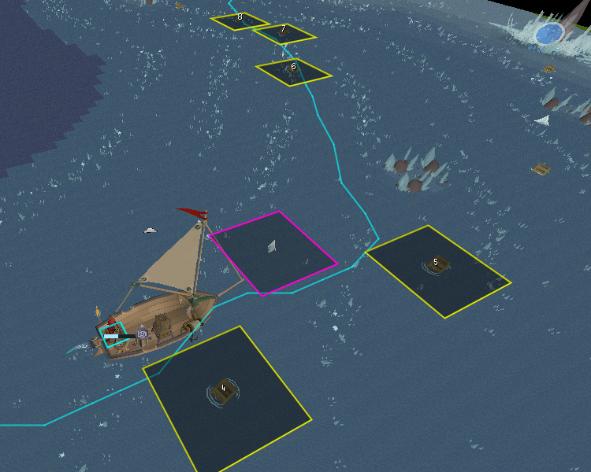
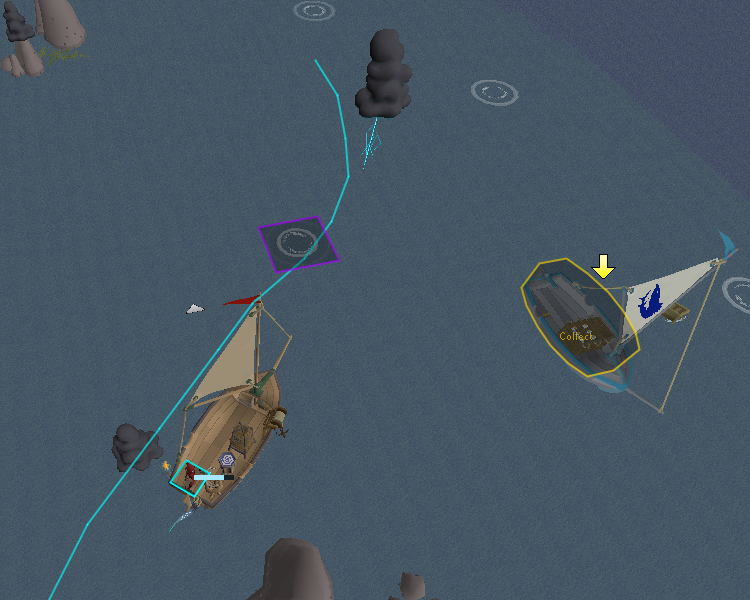
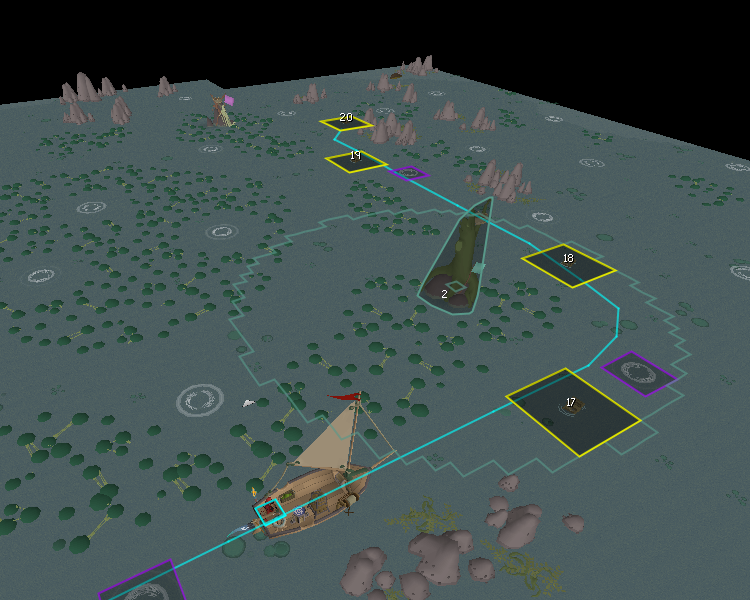
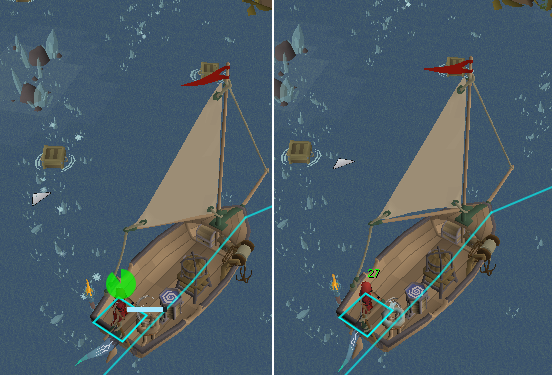

# Barracuda Trials

For the Sailing Barracuda Trials - provides overlays for route, rapids, motes, and more.

## Routing

- Auto-detects trial and difficulty and loads the correct route.
- Routes are shown in chunks to avoid overlapping lines and clutter.
- Can add multiple route variants (Wiki route as default), with config options to switch.
- Customisable colour and appearance.

#### Line

- Thin, clean line overlay (instead of chunky tile markers).

#### Lost Supplies

- Toggle for lost supply hitbox or small highlight.
- Toggle for number overlay for each lost supply in order.

## Tempor Tantrum

- Smart collect/deliver boat highlighting.

## Jubbly Jive

- Smart Jubbly pillar highlight order, custom loaded into each route.
- Toggle for throw range for Jubbly pillars, highlighting tiles around the pillar.

## Gwenith Glide

- Crystal Mote highlight toggle, custom to route, only highlighting relevant motes in chunks to reduce clutter.

## Other

- Rapid highlight toggle, custom to route, only highlighting relevant rapids in chunks to reduce clutter.
- Speed boost overlay above head to maintain boost, can customise appearance (Pie/Text).

